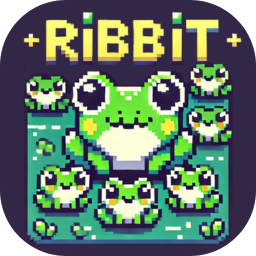

# 🐸 RIBBIT

  

  
  
  
  

---

## Description

Web... perdón, **juego de escritorio** — saltar y esquivar estilo *Frogger*, desarrollado en **C++/CLI** (Windows Forms) con Visual Studio 2022.

Guiá a tu rana por el río, subite a troncos y caimanes buenos, esquivá a los malos, y llevá a las ranitas perdidas hasta la orilla antes de que se acabe el tiempo.

- **Creado por:** Brianna Salinas Guzmán
- **Lanzamiento:** marzo de 2025
- **Instagram:** [@zeven.so](https://instagram.com/zeven.so)

---
 
## Screenshots
 

  
  
  

  
  
  

  
  
  

---
## Features

| Pantalla | Descripción |
|---|---|
| **Menú principal** | Jugar, instrucciones, créditos, salir |
| **Ingreso de nombre** | El jugador escribe su nombre antes de empezar |
| **Selección de rana** | Elegí entre 4 skins distintos de rana |
| **Nivel 1 / 2 / 3** | Tres niveles jugables con dificultad creciente |
| **Historia** | Narrativa ilustrada entre cada nivel |
| **Ganaste / Perdiste** | Pantallas de resultado con opción de reintentar o salir |

- **Sistema de vidas** — 4 vidas compartidas a lo largo de toda la partida
- **Tiempo límite por nivel** — cada nivel tiene su propio cronómetro
- **Mecánica de rescate** — recolectá y depositá ranitas en zonas de salvación para sumar puntaje
- **Plataformas en movimiento** — troncos y caimanes "buenos" te llevan; los "malos" te restan una vida
- **Música y efectos de sonido** por nivel y por acción (salto, recolectar, etc.)
- **Instalador con ícono propio** — empaquetado con Inno Setup, listo para distribuir

---

## Controles

| Tecla | Acción |
|---|---|
| ↑ ↓ ← → | Mover a la rana |
| Espacio | Recoger / dejar una ranita |

---

## Tech Stack

| Technology | Version | Role |
|---|---|---|
| [C++/CLI](https://learn.microsoft.com/cpp/dotnet/dotnet-programming-with-cpp-cli-visual-cpp) | — | Lenguaje principal (interoperabilidad nativa/.NET) |
| [.NET Framework](https://dotnet.microsoft.com) | 4.7.2 | Runtime |
| [Windows Forms](https://learn.microsoft.com/dotnet/desktop/winforms) | — | Interfaz gráfica |
| [GDI+](https://learn.microsoft.com/windows/win32/gdiplus/-gdiplus-gdi-start) | — | Renderizado 2D (`System.Drawing`) |
| [Visual Studio](https://visualstudio.microsoft.com) | 2022 (v143) | IDE |
| [MCI / winmm](https://learn.microsoft.com/windows/win32/multimedia/multimedia-command-strings) | — | Reproducción de audio (`.wav`) |
| [Inno Setup](https://jrsoftware.org/isinfo.php) | 6 | Empaquetado del instalador |

---

## Requisitos del sistema

- Windows 10 / Windows 11
- 240 MB de espacio en disco
- 16 GB de RAM (mínimo recomendado)
- No requiere conexión a internet

---

## Instalación

1. Descargá `RibbitSetup.exe` desde la última release.
2. Ejecutalo y seguí los pasos del instalador.
3. Al finalizar, iniciá el juego desde el acceso directo del escritorio o el menú inicio.

Para compilar desde el código fuente: abrí `Juego.sln` en Visual Studio 2022, seleccioná configuración **Release / x64**, y compilá (`Ctrl+Shift+B`). El proyecto copia automáticamente la carpeta `img` (assets, imágenes y sonidos) a la carpeta de salida.

---

## Changelog

### 🐛 Correcciones de bugs y estabilidad

- **Excepción al iniciar (`FileNotFoundException` en `SoundPlayer`):** las rutas de audio eran relativas al directorio de trabajo del proceso, no al ejecutable. Se agregó un Post-Build Event que copia la carpeta `img/` (incluyendo `musica/`) junto al `.exe` en cada compilación.
- **Rendimiento — recarga de imágenes en cada frame:** `corazon.png` y `ranita.png` se volvían a cargar desde disco 30 veces por segundo dentro del bucle de dibujado. Ahora se precargan una sola vez al iniciar cada nivel y se reutilizan.
- **Se podía pasar de nivel sin ganarlo:** al cerrar la ventana del nivel con la X, el juego asumía que habías ganado si todavía tenías vidas, sin chequear si realmente se había alcanzado el puntaje de victoria. Se agregó una bandera `nivelCompletado` que solo se activa al llegar al puntaje real de victoria.
- **Lectura de memoria inválida:** en el cierre de cada nivel se llamaba a `delete` sobre el controlador del juego *antes* de leer sus datos. Se reordenó la lógica para leer primero y liberar después.
- **Animación de "abrir regalo" aparecía siempre:** independientemente de si se cerraba la ventana con el botón "ABRIR AHORA" o con la X, se mostraba igual la animación. Ahora solo se muestra si se presionó el botón correspondiente.
- **Crash (`ObjectDisposedException`) al elegir "CERRAR JUEGO" tras perder:** el código intentaba volver a mostrar el menú principal después de que la aplicación ya se estaba cerrando. Se agregó una bandera para distinguir "cerrar la app" de "volver a jugar" y evitar tocar una ventana ya destruida.
- **Ventana de consola abriéndose junto al juego (compilación Release):** faltaba configurar el subsistema de Windows en el linker para la configuración Release/x64. Se agregó `SubSystem=Windows` y `EntryPointSymbol=main` al proyecto.

### 🧹 Gestión de memoria

- Se corrigieron múltiples fugas de recursos: las ventanas de regalo, historia, carga de nivel, selección de rana, instrucciones, créditos y salir se creaban con `gcnew` pero nunca se destruían explícitamente. Ahora cada una se libera (`delete`) apenas termina de usarse.

### 📖 Legibilidad de código

- Se reemplazaron números mágicos en la lógica de movimiento del jugador (`Jugador.h`) por constantes con nombre descriptivo, sin modificar ningún valor ni comportamiento del juego.

### 📦 Empaquetado

- Se armó un instalador profesional con **Inno Setup**, que incluye el ejecutable, los assets, accesos directos con ícono personalizado, y pantallas de bienvenida/requisitos del sistema.

### 🗂️ Repositorio

- Se agregó `.gitignore` para excluir carpetas de build y caché de Visual Studio (`.vs/`, `Debug/`, `Release/`, `x64/`, archivos `.ipch`, etc.) que superaban el límite de tamaño de GitHub.

---

## Licencia

Todos los derechos reservados © 2025 Brianna Salinas Guzmán.
